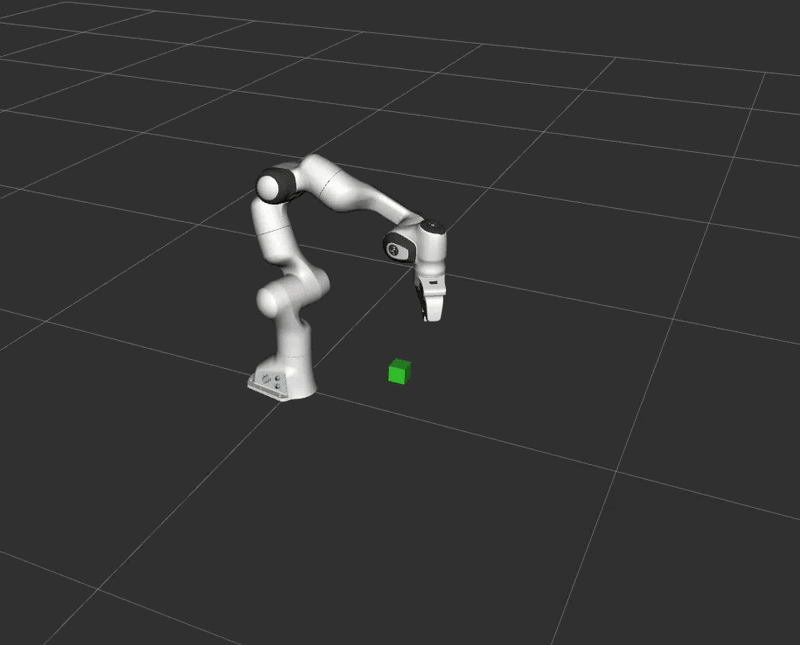

# MoveIt 2 Pick and Place with Inverse Kinematics (IK)

This repository contains a ROS 2 and MoveIt 2 Python implementation for a autonomous **Pick and Place** task using the 7-DOF Franka Emika Panda Robot Arm. The project leverages MoveIt 2's Kinematics Solver to dynamically compute **Inverse Kinematics (IK)** solutions for target object coordinates rather than relying on predefined joint angles.

---
## 📺 Simulation Demo


## 🚀 Project Workflow

The robot automates the full pick-and-place sequence dynamically:
1. **Spawn Object:** Spawns a 5cm target cube into the RViz Planning Scene at specified coordinates.
2. **Pre-Grasp Move:** Joint-space planning moves the arm into a safe posture directly above the target.
3. **IK Computation & Approach:** Queries the `/compute_ik` service to find precise joint coordinates matching the target cube’s Cartesian position, then moves to grip.
4. **Grasp/Attach:** Updates the Planning Scene to attach the cube to the `panda_hand` gripper.
5. **Transport:** Moves the arm along with the attached object to a designated side location.
6. **Place/Detach:** Unlinks the object from the gripper, dropping it smoothly at the new side coordinates.
7. **Return Home:** The empty gripper returns safely back to its initial home position.

---

## 🛠️ Prerequisites & Environment

* **OS:** Ubuntu 22.04 LTS (or compatible Linux distro)
* **ROS 2 Distribution:** Humble Hawksbill
* **Key Dependencies:** MoveIt 2, `moveit_resources`

---

## 🏗️ Installation & Setup

1. **Create and Navigate Workspace:**
   ```bash
   mkdir -p ~/Robotics/moveit_ws/src
   cd ~/Robotics/moveit_ws/src
